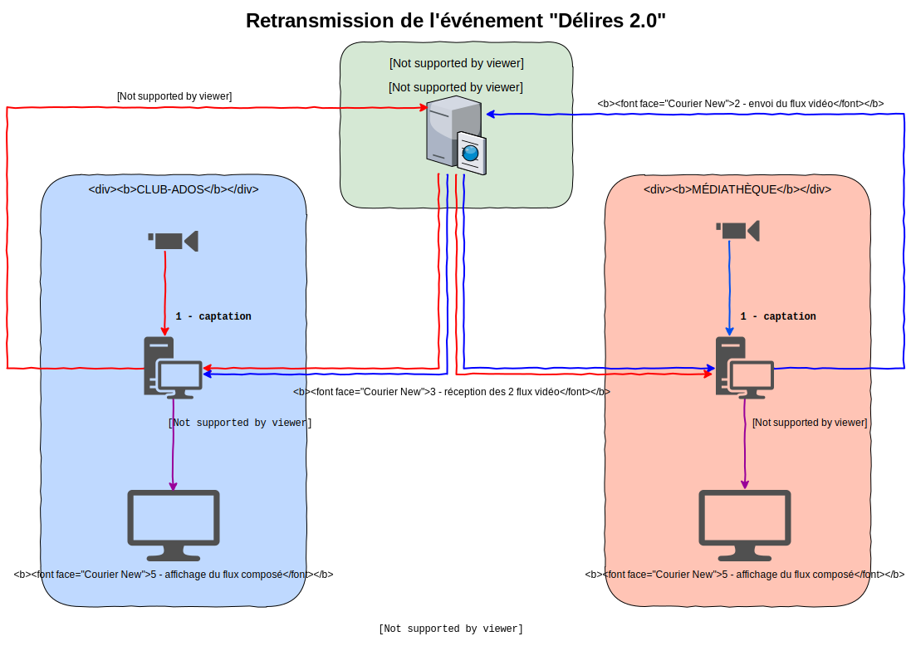

# delires-2.0

Projet de streaming de l'événement Délires 2.0 le samedi 6 octobre 2018 à Villemoisson-sur-Orge

## Présentation

faire un schéma descriptif

## Préparation du matériel

- 2 Mac Mini
- 1 Macbook Pro
- 2 caméras
- du cable réseau

## Utilisation

- Lancer OBS
- Lancer ./stream-local-compo-manager.sh
- Lancer ./start-vlc

Sur les 2 postes

