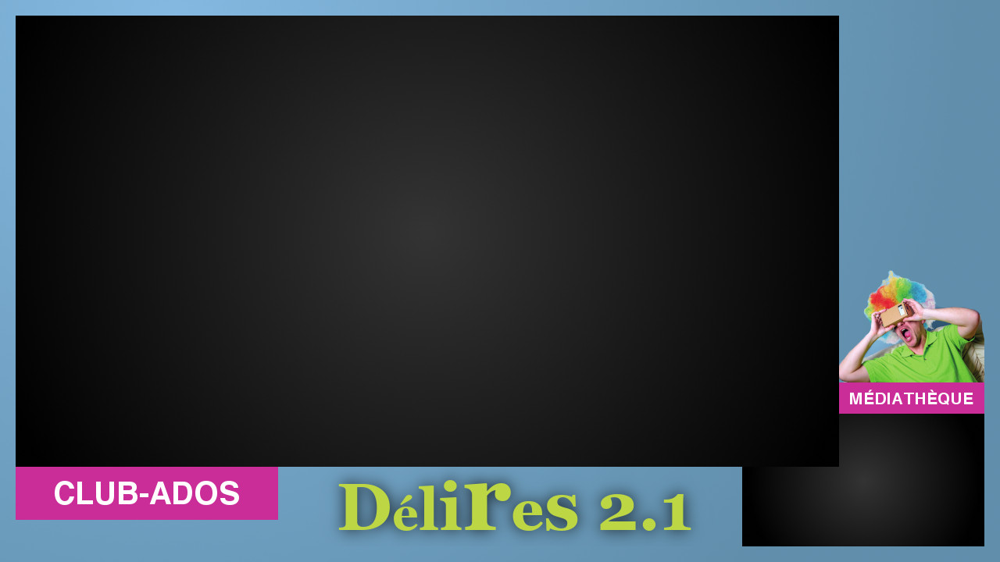

# delires-2.1

Projet de streaming de l'événement Délires 2.1 le samedi 5 octobre 2019 à Villemoisson-sur-Orge

## Présentation

- Chaque station capte un flux issu d'une caméra (Firewire, USB peu importe)
- Ce flux brut est envoyé au serveur de streaming IceCast après avoir été encodé en h264 dans un conteneur mpegts par le logiciel OBS Studio
- La station de réception (qui peut être la même que celle de captation/émission) a pour charge de générer un habillage personnalisé composé d'une image de fond et des 2 flux vidéos reçus, et l'exporte dans un flux vidéo transporté par udp
- Enfin une station de projection (qui peut être la même que celle de réception) reçoit ce flux vidéo udp final et l'affiche sur son écran

## Préparation du matériel

- 2 Mac Mini
- 1 Macbook Pro
- 2 caméras
- du cable réseau

## Logiciels requis

Installer sur chaque poste :

- OBS Studio (https://obsproject.com/fr)
- ffmpeg (v4 ou v3)
- vlc
- ce repository à clôner

## Utilisation

- paramétrer config.sh
- Lancer OBS Studio avec le preset pour uploader au serveur de streamin AD'HOC
- Lancer ./stream-local-compo-manager.sh
- Lancer ./start-vlc.sh

(Sur les 2 postes)

## Habillages

sur le site Club-Ados sera affiché l'habillage suivant :

sur le site Médiathèque sera affiché l'habillage suivant :

